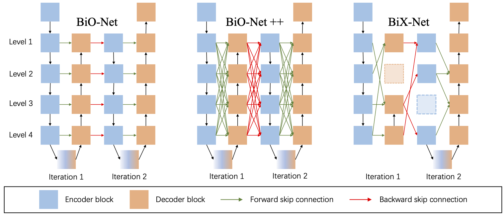

# BiX-NAS

This repository contains the official implementation of the following paper:

> **BiX-NAS: Searching Efficient Bi-directional Architecture for Medical Image Segmentation**
>
> [Xinyi Wang](https://scholar.google.com/citations?user=_uPPBqUAAAAJ&hl=en)\*, [Tiange Xiang](https://scholar.google.com/citations?user=sskixKkAAAAJ&hl)\*, [Chaoyi Zhang](https://chaoyivision.github.io/), [Yang Song](http://www.cse.unsw.edu.au/~ysong/), [Dongnan Liu](https://scholar.google.com/citations?user=JZzb8XUAAAAJ&hl=zh-CN), [Heng Huang](http://www.pitt.edu/~heh45/), [Weidong Cai](https://www.sydney.edu.au/engineering/about/our-people/academic-staff/tom-cai.html)
>
> \* Equal first-author contributions.
>
> [MICCAI 2021](https://arxiv.org/pdf/2106.14033.pdf)
>
> **Abstract** The recurrent mechanism has recently been introduced into U-Net in various medical image segmentation tasks. Existing studies have focused on promoting network recursion via reusing building blocks. Al- though network parameters could be greatly saved, computational costs still increase inevitably in accordance with the pre-set iteration time. In this work, we study a multi-scale upgrade of a bi-directional skip connected network and then automatically discover an efficient architec- ture by a novel two-phase Neural Architecture Search (NAS) algorithm, namely BiX-NAS. Our proposed method reduces the network compu- tational cost by sifting out ineffective multi-scale features at different levels and iterations. We evaluate BiX-NAS on two segmentation tasks using three different medical image datasets, and the experimental results show that our BiX-NAS searched architecture achieves the state-of-the- art performance with significantly lower computational cost. 
>
> [[Project page]](https://bionets.github.io) [[Arxiv]](https://arxiv.org/pdf/2106.14033.pdf) [[Supp.]](https://bionets.github.io/bixnet_supplementary.pdf) [[Video]](https://bionets.github.io)

<!--  -->


<!-- Figure. Our proposed 3D point-based scene graph generation (SGG<sub>point</sub>) framework consisting of three sequential stages, namely, scene graph construction, reasoning, and inference. -->

## Installation and Basic Usages

**Installation**

Make sure you have **pip** available in your system, and simply run:

```pip install -r requirements.txt```

**Basic Flags**

- ```--exp```: your experimentation indicator. Needs to be unique for different runs.
- ```--iter```: define iteration time. Our BiX-Net requires iter=3.
- ```--train_data```: specify the path to load training set.
- ```--valid_data```: specify the path to load validation set.
- ```--valid_dataset```: validation dataset choose from [monuseg, tnbc].
- ```--lr```: define learning rate.
- ```--epochs```: define the number of epochs.
- ```--batch_size```: batch_size for training or searching.

## Dataset
**Please refer to the official website (or project repo) for license and terms of usage.**
**We preprocessed the data for adaptating our data loaders. Please find the links below.**

*NOTE: Default path to load data is ```./data```*

**MoNuSeg**

Download the preprocessed data from the link below and put data to ```./data```. Alternatively, you  may use the flags ```--train_data``` and ```--valid_data``` to specify the paths to your monuseg data.

- Official Website: https://monuseg.grand-challenge.org/Data/
- Baidu Disk: https://pan.baidu.com/s/1tqDzX52v8GYWXF4YfUGu1Q password: dqsr
- Google Drive: https://drive.google.com/file/d/1j7vEoq6YCBNKMoOZKPSQNciHZkVzkxGD/view?usp=sharing

**TNBC**

Download the preprocessed data from the link below and put data to ```./data```. Alternatively, you
may use the flags ```--valid_dataset=tnbc``` and ```--valid_data``` to specify the path to your tnbc data.

- Official Repo: https://github.com/PeterJackNaylor/DRFNS
- Baidu Disk: https://pan.baidu.com/s/1zPWTYAEffX55c2eyb3cU0Q password: zsl1
- Google Drive: https://drive.google.com/file/d/1RYY7vE0LAHSTQXvLx41civNRZvl-2hnJ/view?usp=sharing


## Usage

<!-- **Searching** -->

Our method consists of two searching phases, you need to run Phase1 search and Phase2 search sequentially to produce the final architecture gene. i.e., you need Phase1 searched gene to initiate Phase2 search.
Warning: Note that we found that MACs can be different when computing on different devices.

### Phase1 search

```
python3 ./CORE/Phase1main.py --Phase1 --exp EXP_1
```

You may Use ```--save_gene``` to specify where to save the Phase1 searched genes (that will be used in Phase2). Default path is```./phase1_genes```. You could also search a bi-directional architecture with more iterations, use the ```--iter``` flag.


Alternatively, you can directly modify ```./start_phase1.sh``` and run:
```
sh ./start_phase1.sh
```

### Phase2 search

```
python3 ./CORE/Phase2main.py --gene SEARCHED_PHASE1_GENE --exp EXP_1
```

You may Use ```--save_gene``` to specify where to save the Phase2 searched genes.  Default path is ```./phase2_genes```. The winner of Phase2 searched genes can be found in ```PATH_TO_SAVE_PHASE2_GENE/EXP_1/iteration_1/winners```, then you can pick the one you like and run retrain.

Alternatively, you can directly modify ```./start_phase2.sh``` and run:
```
sh ./start_phase2.sh
```

### Retraining

Your can use your previously Phase2 searched gene, or our provided BiX-Net gene to retrain on the two nuclei datasets.

```
python3 ./CORE/Phase1main.py --gene SEARCHED_PHASE2_GENE --exp EXP_1
```

You may Use ```--save_result``` to save the best metrics and segmentation masks in ```./checkpoints/EXP_1/```.


Alternatively, you can directly modify ```./start_retrain.sh``` and run:
```
sh ./start_retrain.sh
```

### Evaluation

After obtained a retrained model, you can run evaluation on the checkpoint only to get the evaluation metrics and segmentation masks. 

```
python3 ./CORE/Phase1main.py --evaluate_only --gene SAVED_PHASE2_GENE --exp EXP_1 --save_result
```

<!-- To specify a pretrained model directly (e.g. our pretrained [BiX-Net](https://drive.google.com/drive/folders/180Fz-iSTkEFuebzqBgfGcQgfdjVG4rGV?usp=sharing)): -->
You can directly pull our pretrained BiX-Net, i.e., ```bixnet_monuseg.pt```, ```bixnet_tnbc.pt``` from this repo.
To specify a pretrained model directly:
```
python3 ./CORE/Phase1main.py --evaluate_only --gene SAVED_PHASE2_GENE --model_path MODEL_CHECKPOINT --save_result
```

Evaluate our BiX-Net on **MoNuSeg**:
```
sh ./start_monuseg.sh
```

Evaluate our BiX-Net on **TNBC**:
```
sh ./start_tnbc.sh
```

### Direct Usage of BiX-Net

You are welcome to use our best searched model (BiX-Net) directly in your framework or for comparison.

First, please copy ```./CORE/pytorch_version/Phase2model.py``` and ```./CORE/pytorch_version/Phase2tools.py``` to your directory. Then, copy the BiX-Net gene ```./BiXNet_gene.txt```. Finally, use the following code snippt for inference:

```
from .Phase2model import Phase2
from .Phase2tools import decode

bixnet_gene_path = '...'

gene = decode(bixnet_gene_path, tot_iteration=3) 
model = Phase2(in_channel=3,
         iterations=3,
         num_classes=1,
         gene=gene).to(device).float()
```
Also, you can check with Google Colab: https://colab.research.google.com/drive/1USs9547kbDaxMEz4wv2ZXQC5fmMn_DrB?usp=sharing.

## Citation

If you find our data or project useful in your research, please cite:

```
@inproceedings{wang2021bix,
    title={BiX-NAS: Searching Efficient Bi-directional Architecture for Medical Image Segmentation},
    author={Wang, Xinyi and Xiang, Tiange and Zhang, Chaoyi and Song, Yang and Liu, Dongnan and Huang, Heng and Cai, Weidong},
    booktitle={International Conference on Medical Image Computing and Computer-Assisted Intervention (MICCAI)},
    year={2021},
    organization={Springer}
}
```
#### Acknowledgments
This repo. template was borrowed from [Chaoyi Zhang's Project](https://github.com/chaoyivision/SGGpoint). 